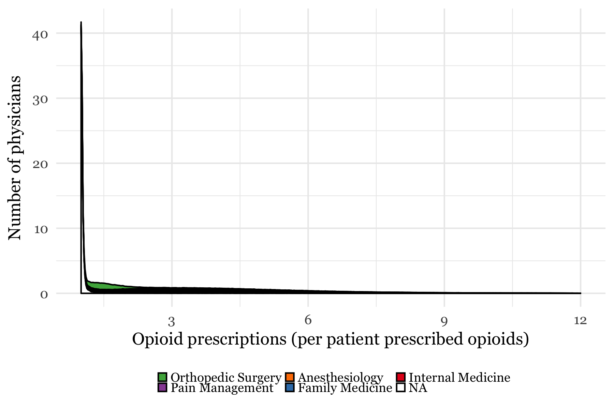

# Primary Care Doctors Prescribe the Most Opioids

In the early 2000s, when opioid manufacturers were seeking ways to spread new drugs to more patients, a [new plan](http://ajph.aphapublications.org/doi/abs/10.2105/AJPH.2007.131714) was formed: target the primary care docs.

These doctors were not trained to treat chronic pain.  Nor were they routinely performing painful procedures.  They delivered babies, treated children sick with the flu, performed annual physical exams, and cared for the elderly.

In other words, they saw the most patients.  And that's precisely what made them attractive to opioid manufacturers.

Over 15 years later, the marketing plan seems to have paid off.  In 2015, only pain management, anesthesiologists, and rehabilitation doctors prescribed more opioids than primary care doctors on average.  And in total, primary care specialties like family and internal medicine prescribed the most by far.

This could be due to the sheer number of primary care doctors, or the fact that primary care doctors have more patients than other specialties. But they prescribe more than others even after controlling for these confounds.

<<<<<<< HEAD

=======
Consider Michael Lochtefeld, a dentist in South Carolina. In 2015, he made 49 opioid prescriptions to 42 patients, amounting to a prescription-to-patient ratio of 1.2--average among dentists.
>>>>>>> master

Now consider Deepthi Singham, a family physician in Ohio. He made 304 opioid prescriptions to 84 patients in 2015, amounting to a prescription-to-patient ratio of 4.4--average among family physicians.

Drs. Lochtefeld and Singham form two ends of a spectrum. The low-prescription end includes specialties like dentistry, orthopedic surgery, and emergency medicine, all of which are characterized by narrow ranges of prescribing behavior.

The high-prescription end of the spectrum includes specialties focused on the treatment of pain, like anesthesiology and physical medicine and rehabilitation. These specialties are characterized by wide ranges of prescribing behavior, as indicated by the lack of sharp peaks in their distributions.

<<<<<<< HEAD

=======
Family and internal medicine, the two most common primary care specialties, look  similar to specialties focused on the treatment of pain. Their wide range of prescribing behavior is also apparent geographically. In places like Hancock County, Kentucky, and Randolph County, Georgia, primary care prescription rates were less than 2 prescriptions per person prescribed opioids.  But in places like Summit County, Colorado, and Sitka County, Alaska, rates were over 12 per person&mdash;more than one prescription a month per patient.
>>>>>>> master

There are several potential explanations for the wide range of prescription behavior among primary care physicians. They see the same patients on a recurring basis, which makes them more likely to prescribe more drugs to fewer patients. But that does not explain the geographical variation, which could be due to regional differences in pain prevalence or physician norms.

Regardless of the explanation, one point lingers: it is surprising, and perhaps alarming, that family medicine doctors prescribe more opioids per patient than pain management doctors. That is evidence, perhaps, of a marketing plan gone wrong.

# Should Big Pharma Market Opioids?

In August 1999, three Abbott Laboratories executives known as the Empress of Analgesia, Wizard of Oxycontin, and Queen of pain sent a report to the company's sales team.

"The Royal Court wishes to honor all Crusaders," it started, "for their continued advocacy of postoperative pain management to doctors thoughout the land."

Two particular "Crusaders," or sales representatives, were especially worth honoring. They had managed to schedule a luncheon with a university-affiliated orthopedic surgeon who "rarely attended lunch and learn programs."

The surgeon expressed little interest in the OxyContin at first. But the sales team persisted. They visited his office once a week. They learned of his sweet tooth and brought him foods he liked. And they asked him to switch his patients over to OxyContin three at a time. "Using doughnuts and other treats illustrated the sweet benefits of Oxycontin," they wrote.

The relationship between pharmaceutical companies and doctors has long been under scrutiny. It is especially worth scrutinizing in light of the opioid epidemic, since overprescription of opioids like OxyContin can have devastating consequences.

Most relationships between opioid manufacturers and physicians begin at meetings in clinics and hospitals, where doctors learn about new drugs or indications in exchange for a meal. Data on each of these transactions is recorded and made available to the public, along with data on physician prescribing habits.

Combining these data sources shows that doctors who attended more opioid-related meetings prescribed more opioids. One additional meeting was associated with 33 additional 30-day prescriptions made in 2015.

Some specialties, like pain management or anesthesiology, had higher opioid prescription rates than others. But the positive relationship between meetings and prescriptions remaines true within specialties as well.

This does not imply that pharmaceutical companies are causing high prescription rates. They could, for example, be targeting doctors already prescribing opioids at a high rate without further influencing their prescription patterns. This leaves us with a chicken or egg problem: are prescription rates causing payments, or are payments causing prescription rates?

To address this question, consider a group of doctors who attended zero meetings in 2013 and 2014. These doctors can be divided into three groups based on how many meetings they attended in 2015: those who attended zero, those who attended one to nine, and those who attended 10 or more meetings.

If prescriptions are causing payments, then doctors who attended more meetings in 2015 would have already had higher prescription rates in 2014. If payments are causing prescriptions, then gaps between the groups would increase after 2014.

As it turns out, both trends are true in the data. Compared with doctors who attended 1-9 meetings, doctors who attended 10 or more meetings were already prescribing 91% more opioids in 2014--evidence of targeting. But by 2015, the gap in prescriptions between these groups also increased significantly, indicating that the meetings had their intended effect.

But even if it were conclusive, the policy conclusion would not be trivial. On the one hand, if advertising is causing overprescription, and overprescription is causing deaths, then it would seem reasonable to more strictly regulate the advertising of opioids. While such a policy could improve deaths, particlarly in areas of the country where overdose deaths are commonplace, it could replace those deaths with an epidemic of debilitating chronic pain.

Then ideal policy, then, requires a delicate balance between reducing overprescription and treating pain. Until such a policy is implemented, there is no room for empresses, wizards, queens, or crusaders. Only healers.

#### Next steps

- Be clearer about data sources
- Document any data restrictions made in each plot
- Interview top prescribers
- Interview patients
