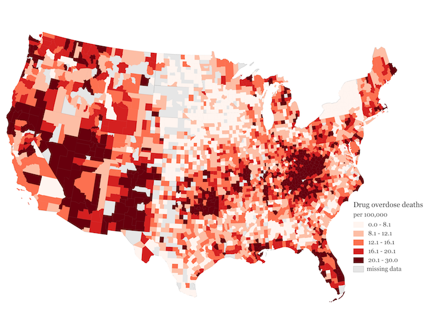

# Part 1: Primary Care Doctors Prescribe the Most Opioids

In the early 2000s, when opioid manufacturers were seeking ways to spread new drugs to more patients, a [new plan](http://ajph.aphapublications.org/doi/abs/10.2105/AJPH.2007.131714) was formed: target the primary care docs.

These doctors were not trained to treat chronic pain.  Nor were they routinely performing painful procedures.  They helped give birth, treated children sick with the flu, performed annual physical exams, and cared for the elderly.

In other words, they saw the most patients.  And that's precisely what made them attractive to opioid manufacturers.

Over 15 years later, the marketing plan seems to have paid off.  In 2015, only pain management, anesthesiologists, and rehabilitation doctors prescribed more opioids than primary care doctors on average.  And in total, primary care specialties like family and internal medicine prescribed the most by far.

This could be due to the sheer number of primary care doctors, or the fact that primary care doctors have more patients than other specialties. But as it turns out, they prescribe more than others even after controlling for these potential confounds.

Consider Emmanuel Saez, a dentist in Ohio. In 2015, he made XX opioid prescriptions to 32 patients, amounting to a prescription-to-patient ratio of 2--average among dentists.

Now consider Jonathan Gruber, a family physician in Texas. He made 100 opioid prescriptions to 50 patients in 2015, amounting to a prescription-to-patient ratio of 3--average among family physicians.

Drs. Gruber and Saez form two ends of a spectrum. Dentists, who routinely prescribe opioids like X to their patients following surgery, are on one end. Family physicians, who XX, are on the other.

The low-prescription end of the spectrum includes specialties like orthopedic surgery, emergency medicine, and dentistry, all of which are characterized by narrow ranges of prescribing behavior. For example, over 95% of general surgeons prescribed between 0 and 3 opioids per person in 2015.

The high-prescription end of the spectrum, unsurprisingly, includes specialties focused on the treatment of pain, like anesthesiology and physical medicine and rehabilitation. But it also includes family and internal medicine. These specialties are characterized by wide ranges of prescribing behavior, as indicated by the lack of sharp peaks in their distributions.

The wide range of prescribing behavior among primary care physicians is also apparent geographically. In places like Hancock County, Kentucky, and Randolph County, Georgia, rates were less than 2 prescriptions per person prescribed opioids.  But in places like Summit County, Colorado, and Sitka County, Alaska, rates were over 12 per person&mdash;more than one prescription a month per patient.

There are several possible explanations for the wide range of prescription behavior among primary care physicians. Because they see the same patients on a recurring basis, they're more likely to prescribe the same patient the same drug multiple times in a year. But that does not explain the geographical variation, which could be explained by regional differences in pain prevalence or tolerance levels, or by differences in how medicine is practiced.

Regardless of the explanation, one point lingers: it is surprising, and perhaps alarming, that family medicine doctors prescribe more opioids per patient than pain management doctors. That is evidence, perhaps, of a marketing plan gone wrong.

# Part 2: Should Big Pharma Market Opioids?

In August 1999, three Abbott Laboratories executives known as the Empress of Analgesia, Wizard of Oxycontin, and Queen of pain sent a report to the company's sales team.

"The Royal Court wishes to honor all Crusaders," it started, "for their continued advocacy of postoperative pain management to doctors thoughout the land."

Two particular "Crusaders," or sales representatives, were especially worth honoring. They had managed to schedule a luncheon with a university-affiliated orthopedic surgeon who "rarely attended lunch and learn programs."

The surgeon expressed little interest in the OxyContin at first. But the sales team persisted. They visited his office once a week. They learned of his sweet tooth and brought him foods he liked. And they asked him to switch his patients over to OxyContin three at a time. "Using doughnuts and other treats illustrated the sweet benefits of Oxycontin," they wrote.

The relationship between pharmaceutical companies and doctors has long been under scrutiny. It is especially worth scrutinizing in light of the opioid epidemic, since overprescription of opioids like OxyContin can have devastating consequences.

Most relationships between opioid manufacturers and physicians begin at meetings in clinics and hospitals, where doctors learn about new drugs or indications in exchange for a meal. Data on each of these transactions is recorded and made available to the public, along with data on physician prescribing habits.

The data show that doctors who attended more opioid-related meetings prescribed more opioids. One additional meeting was associated with XX additional 30-day prescriptions on average.

Some specialties, like pain management or anesthesiology, had higher opioid prescription rates than others. But the trend of prescribing more given more meetings remained true within specialties as well.

This does not imply that pharmaceutical companies are causing high prescription rates. They could, for example, be targeting doctors already prescribing opioids at a high rate without further influencing their prescription patterns. This leaves us with a chicken or egg problem: are prescription rates causing payments, or are payments causing prescription rates?

To address this question, consider a group of doctors who attended zero meetings in 2013 and 2014. These doctors can be divided into three groups based on how many meetings they attended in 2015: those who attended zero, those who attended one to nine, and those who attended 10 or more meetings.

If prescriptions are causing payments, then doctors who attended more meetings in 2015 would have already had higher prescription rates in 2014. If payments are causing prescriptions, then gaps between the groups would increase after 2014.

Both trends are true in the data. Compared with doctors who attended 1-9 meetings, doctors who attended 10 or more meetings were already prescribing XX% more opioids in 2014--evidence of targeting. But by 2015, the gap in prescriptions between these groups also increased significantly, indicating that the meetings had their intended effect.

Should we end the practice of advertising? It is not clear. On the one hand, if advertising is causing overprescription, and overprescription is causing deaths, then perhaps the answer is yes.

But on the other hand, it could be the case that pharmaceutical companies are helping doctors better treat pain. When in doubt, one can simply read reviews of opioids on websites like WebMD.

One user writes, "". Another writes, "".

Overall, it is likely that opioids are being overprescribed--especially in certain communities where doctors are rumored to be pill mills and XX. But reducing prescription rates without hurting the patients who need pain treatment most would require targeting.

Until that time, it remains unclear whether advertising is improving outcomes. And in the meantime, sales teams should act knowing lives are at stake. A public health emergency has no room for empresses, wizards, queens, or crusaders. Only healers.

### Next steps

Part 1:
- clean up definition of primary care: for now I'm using family med + internal med + general practice as a proxy, so i'm omitting pediatricians and obgyn; it's also the case, i think, that some internal med docs are not considered primary care doctors (e.g., endocrinologists)
- check if primary care docs are prescribing lots of opioids in places where there are no pain specialists. are death rates particularly high in these areas? this would be an interesting take -- basically the lack of specialty care in rural areas has perpetuated the opioid epidemic. could get at this by comparing overdose rates in rural areas with specialty docs vs rural areas without

Part 2:
- maybe bring in geographic data on incidence of chronic pain to control for patient population?
